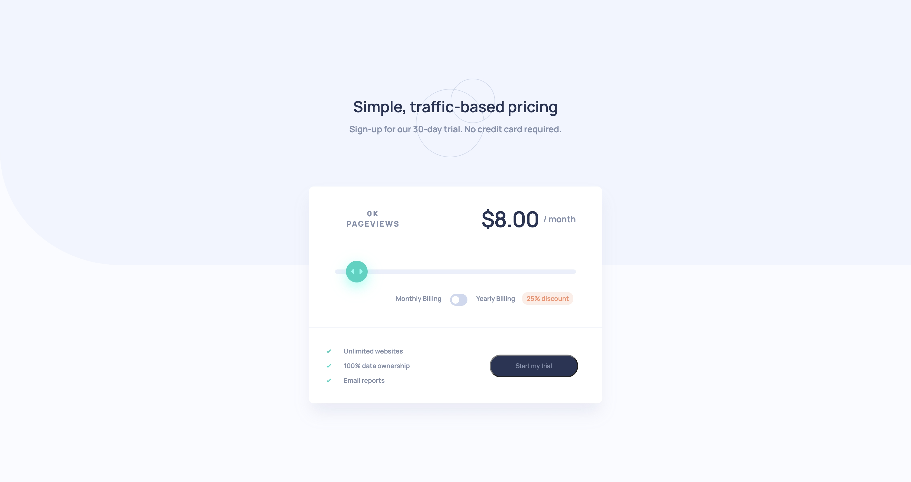

# Frontend Mentor - Interactive pricing component solution

This is a solution to the [Interactive pricing component challenge on Frontend Mentor](https://www.frontendmentor.io/challenges/interactive-pricing-component-t0m8PIyY8). Frontend Mentor challenges help you improve your coding skills by building realistic projects.

## Table of contents

- [Overview](#overview)
  - [The challenge](#the-challenge)
  - [Screenshot](#screenshot)
  - [Links](#links)
- [My process](#my-process)
  - [Built with](#built-with)
  - [What I learned](#what-i-learned)
- [Author](#author)

## Overview

### The challenge

Users should be able to:

- View the optimal layout for the app depending on their device's screen size
- See hover states for all interactive elements on the page
- Use the slider and toggle to see prices for different page view numbers

### Screenshot

### Links

- Live Site URL: [link](https://blogr-murex.vercel.app/)

## My process

### Built with

- React (tried using class based components where applicable)
  - Used custom CSS stylesheets for styling each component
- Flexbox for layouts
- JSX for markups in react components
- Desktop-first workflow with media queries for mobile

### What I learned

This was my first attempt at using class based components to handle state and pass props in a React app. I want to get more practice using the life cycle methods with class based components so I will attempt a few more small apps with this goal in mind.

This was also my first time adding custom styles to the range input and it seemed far more involved than it needed to be. I don't understand why the browsers don't have similar ways to customize the range input, especially since, as a user, I like to use sliders so I figured they would be more supported but at least now I feel I have a good reference for working with them.

## Author

- Website - [Jeff Jakinovich](http://jeffjakinovich.com/)
- Frontend Mentor - [@jljakin2](https://www.frontendmentor.io/profile/jljakin2)
- LinkedIn - [Jeff Jakinovich](https://www.linkedin.com/in/jeff-jakinovich-b6b14943/)
